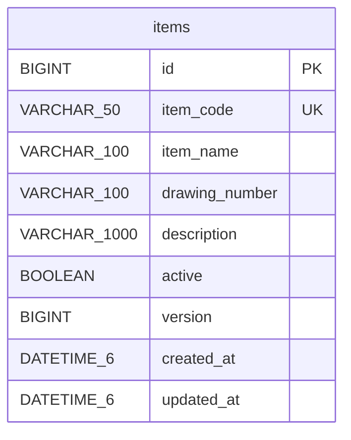

# 현재 구현된 DB 구조

현재 업무 테이블은 **items 하나**입니다. 설비·공정·작업지시·실적 테이블이나 관계는 아직 없습니다. 전체 설계 목표는 [plan.md](plan.md)에서 확인합니다.

## 현재 ERD



다른 업무 테이블이 없으므로 관계선도 없습니다. Flyway의 `flyway_schema_history`는 마이그레이션 도구가 관리하는 이력 테이블이며 items와 외래키 관계가 없습니다.

## 컬럼 정의

| 컬럼 | NULL 허용 | 의미 / 규칙 |
| --- | --- | --- |
| id | 아니오 | 자동 증가 기본키. 내부 식별자 |
| item_code | 아니오 | 품번, 50자, DB 고유 제약 `uc_items_item_code` |
| item_name | 아니오 | 품목명, 100자 |
| drawing_number | 예 | 도면번호, 100자. 입력하지 않은 폼은 빈 문자열 또는 NULL |
| description | 예 | 설명, 1,000자 |
| active | 아니오 | 기본 true. false이면 비활성, 기존 행 보존 |
| version | 아니오 | JPA 낙관적 잠금용 버전, 초기 0 |
| created_at | 아니오 | 최초 등록 시각, 수정해도 유지 |
| updated_at | 아니오 | 마지막 변경 시각 |

시각은 Asia/Seoul 기준 `LocalDateTime`으로 기록하며 DB에는 시간대 없는 DATETIME(6)로 저장합니다. 현재는 로컬 학습용이므로 한국 시간 하나를 기준으로 사용합니다.

품번·품목명에는 DB에서도 NULL과 공백만 있는 값이 들어가지 않게 CHECK 제약을 둡니다. 앱에서는 품번의 대문자 정규화와 영문·숫자로 시작하는 영문·숫자·점·밑줄·하이픈 형식을 추가로 검증합니다. 품번과 품목명은 필수, 도면번호와 설명은 선택입니다. DB 생성 시 utf8mb4와 utf8mb4_0900_ai_ci를 사용합니다. 비활성 품목도 같은 품번을 점유하므로 새 품목에 재사용할 수 없습니다.

현재 DB CHECK는 앱의 정규식 전체를 구현하지 않습니다. SQL로 직접 값을 넣으면 앱 검증을 우회할 수 있으므로 앱의 저장 경로를 사용하세요.

## 스키마 변경 이력

실제 생성 SQL: `src/main/resources/db/migration/V1__create_items.sql`

1. 앱이 DB에 연결
2. Flyway가 미적용 V1을 실행하고 `flyway_schema_history`에 기록
3. JPA가 엔티티와 실제 스키마를 `ddl-auto: validate`로 비교
4. 이후 재실행 시 V1을 재적용하지 않고 기존 행 보존

`clean-disabled: true`, `sql.init.mode: never`를 지정했습니다. 초기화용 `data.sql`, `create-drop`, 자동 삭제 로직은 사용하지 않습니다. 새 테이블이나 컬럼은 `V2__...sql`부터 순서대로 추가하세요. 이미 적용한 V1을 바꾸면 Flyway 체크섬 검증에 실패할 수 있습니다.

## 직접 확인해 볼 SQL

```sql
SELECT id, item_code, item_name, active, version, created_at, updated_at
FROM items ORDER BY id DESC;

SELECT installed_rank, version, description, success
FROM flyway_schema_history ORDER BY installed_rank;

SHOW CREATE TABLE items;
```

이 단계의 핵심 구분: `id`는 내부 기본키, `item_code`는 사람이 사용하는 중복 불가 업무 코드입니다. 이름이 같은 품목은 허용하지만 품번이 같은 품목은 허용하지 않습니다.
