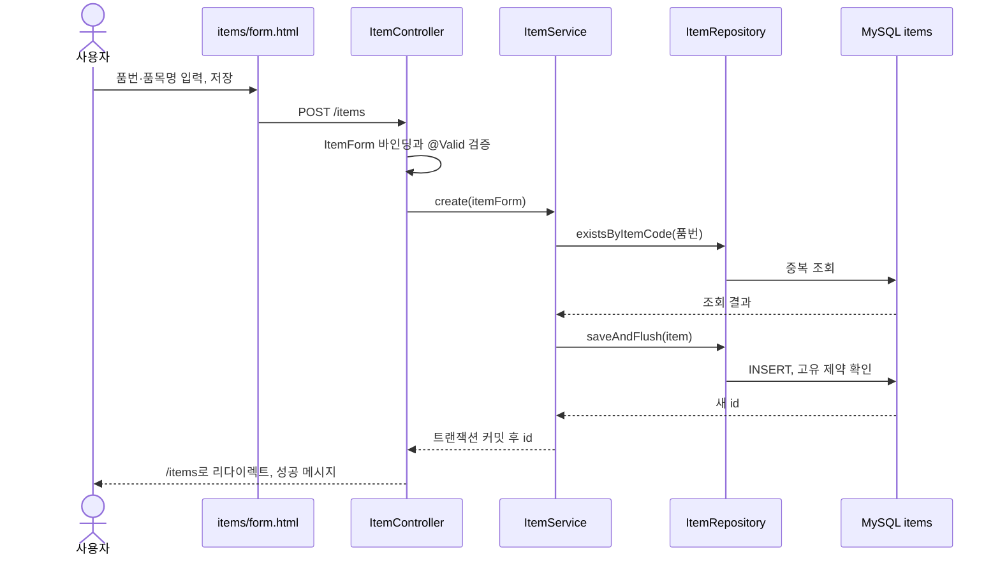

# 1단계 코드 읽기와 직접 수정 연습

## 실제 품목 등록 흐름

## 작성한 파일과 역할

| 파일 | 직접 설명해야 할 역할 |
| --- | --- |
| `src/main/resources/templates/items/form.html` | 입력 폼. `th:field`로 ItemForm 필드 연결, 저장 주소 지정, 한국어 오류 표시 |
| `src/main/java/com/example/minimes/item/ItemForm.java` | 화면 입력값. 공백 제거·대문자 변환, `@NotBlank`, `@Size`, `@Pattern` 검증 |
| `src/main/java/com/example/minimes/item/ItemController.java` | HTTP 주소 처리. 입력 검증 결과에 따라 같은 폼을 보여주거나 서비스 호출. 중복·수정 충돌을 화면 오류로 변환 |
| `src/main/java/com/example/minimes/item/ItemService.java` | 중복 검사와 저장 규칙. `@Transactional`로 저장 단위를 묶음. 다른 호출에서도 `@Valid` 입력 검증 |
| `src/main/java/com/example/minimes/item/ItemRepository.java` | JPA 저장·조회 접근. 메서드 이름으로 품번 중복과 검색 쿼리 생성 |
| `src/main/java/com/example/minimes/item/Item.java` | items에 매핑되는 엔티티. id, 데이터, 등록·수정 시각, `@Version` |
| `src/main/resources/db/migration/V1__create_items.sql` | 실제 MySQL 테이블과 UNIQUE·CHECK 제약 생성 |
| `src/main/java/com/example/minimes/config/DevSampleData.java` | `@Profile("dev")`에서만 예시 등록. 기존 품번은 그대로 둠 |

`@Valid`가 실패하면 Service와 DB 저장까지 가지 않습니다. 중복 품번은 입력값을 지우지 않고 같은 폼에 오류를 보여줍니다. DB 연결 자체가 실패하면 앱 시작이 실패하므로 이 단계에서는 화면의 입력 오류와 구분해 실행 로그를 확인해야 합니다.

## 수정 흐름과 트랜잭션

1. `GET /items/{id}/edit` → Controller → Service.getItem → Repository.findById → DB
2. `ItemForm.from(item)`이 현재 데이터와 version을 폼으로 전달
3. `POST /items/{id}`에서 입력값과 화면을 열었을 때의 version을 전송
4. Service.update가 현재 DB version과 비교하고, **자기 자신의 id를 제외한** 품번 중복 검사
5. 엔티티의 `update()`로 값을 변경하고 flush. JPA가 변경을 감지해 UPDATE 수행
6. 트랜잭션 커밋 후 목록으로 이동

JPA 엔티티를 트랜잭션 안에서 가져오면 변경 내용을 추적합니다. 이 때문에 수정에서는 `save()`를 다시 부르지 않아도 됩니다. `flush()`는 SQL을 DB에 보내는 시점이며 커밋과 같은 뜻은 아닙니다. 도중에 예외가 나면 트랜잭션이 롤백되어 변경을 보존하지 않습니다.

`@Version`은 DB의 현재 버전을 WHERE 조건에 넣고 수정할 때 증가시킵니다. 화면을 연 뒤 다른 요청이 저장한 상황은 폼의 version 비교로, 두 요청이 거의 동시에 저장하는 상황은 JPA 버전 조건으로 감지합니다. 충돌 시 입력을 덮어쓰지 않고 목록에서 다시 열도록 안내합니다. 이 장치는 이력 기록을 대신하지 않습니다.

## 왜 중복을 두 번 검사하나

서비스의 중복 조회는 친절한 메시지를 빨리 제공합니다. 하지만 두 요청이 동시에 ‘없음’을 읽을 수 있으므로 조회만으로는 중복을 보장하지 못합니다. DB의 `UNIQUE(item_code)`가 최종적으로 한 요청만 저장하게 합니다. Controller는 해당 고유 제약 오류도 같은 중복 메시지로 처리합니다. 그 외 DB 규칙 충돌은 별도 일반 오류로 표시합니다.

등록 성공 후 목록으로 리다이렉트하는 방식은 새로고침으로 동일한 POST가 반복되는 것을 줄입니다. 생산실적의 중복 제출 방지 토큰이나 동시 수량 검증은 아직 구현하지 않았습니다.

## 품목 조회와 비활성화

목록 요청은 `GET /items?q=구동축&page=0`입니다. Service가 0부터 시작하는 페이지 번호, 20건 크기, id 내림차순을 정하고 Repository로 조회합니다. 검색어가 없으면 전체 조회, 있으면 품번 또는 품목명 부분 일치 검색입니다. 목록의 페이지 표시만 1부터 시작합니다.

비활성화는 수정 화면의 ‘사용 중인 품목’ 체크 해제 후 저장입니다. `active=false`로 UPDATE하며 DELETE를 실행하지 않습니다. 목록에 비활성 품목도 표시하고, 재활성화도 가능합니다. 비활성 품목의 신규 작업지시 차단은 작업지시 구현 단계에서 추가합니다.

## 직접 해 볼 연습

1. 새 품번 `TRAIN-SHAFT-001`과 품목명 ‘연습용 구동축’을 등록하고 SQL로 한 행이 추가되는지 확인
2. 소문자와 앞뒤 공백을 넣은 같은 품번을 제출하고 중복 오류 이유 설명
3. 같은 품번을 유지한 채 품목명 수정. `existsByItemCodeAndIdNot`에서 왜 id를 제외하는지 설명
4. 수정 화면을 두 탭에 열어 한쪽을 먼저 저장하고 다른 쪽 저장 시 충돌 메시지 확인
5. 비활성화 후 행이 남는지 확인하고 version 증가 확인
6. 설명 최대 길이를 바꾸고 싶다면 먼저 ItemForm, Item 매핑, HTML maxlength, 새 Flyway V2가 모두 왜 필요한지 정리한 후 수정

첫 학습 질문: ‘품번 중복 확인을 Controller에만 두면 어떤 문제가 생길까?’ Service의 업무 규칙은 웹 화면 밖의 호출에서도 필요하고, 최종 중복 보장은 DB에 있어야 한다는 점을 실제 파일로 설명해 보세요.
